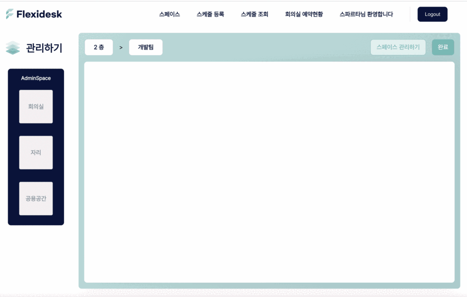
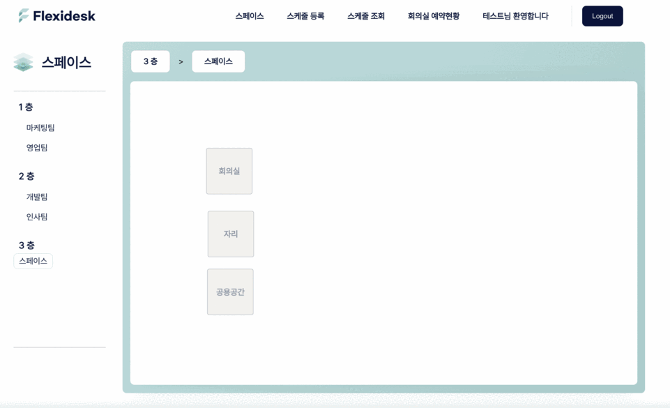
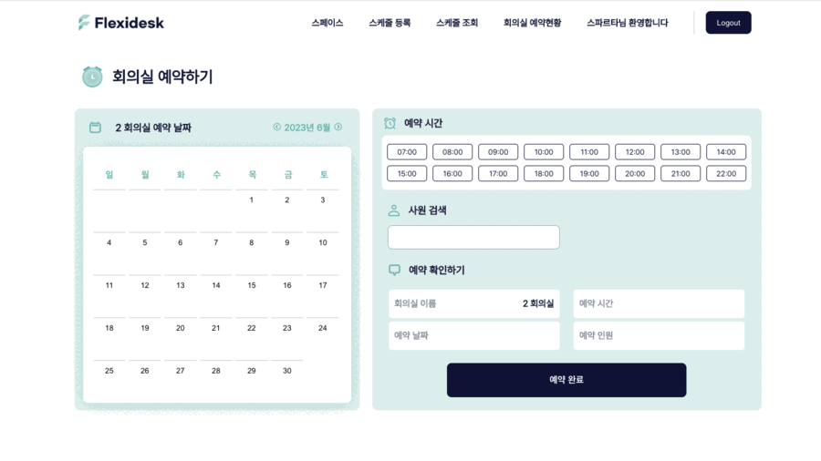
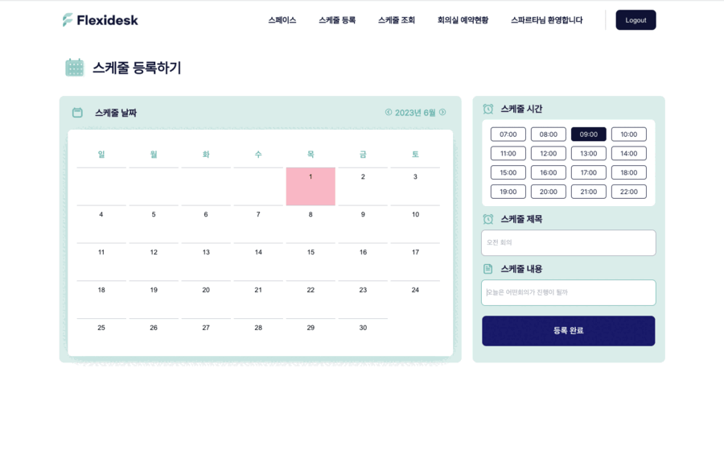
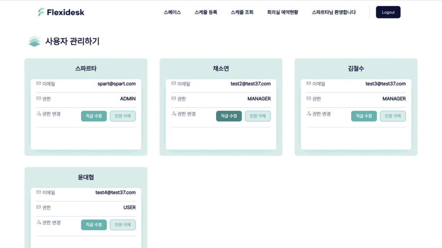

## 프로젝트명 - Flexidesk

## 목차

[1.팀원 구성](#팀원-구성)  
[2.개발 기간](#개발-기간)  
[3.프론트 기술스택](#프론트엔드-기술스택)  
[4.프로젝트 특징](#프로젝트-특징)  
[5.주요 기능](#주요-기능)  
[6.배포 사이트](#배포-사이트)  
[7.Tech Stacks](#tech-stacks)  
[8.아키텍쳐](#아키텍쳐)  
[9.API 명세](#api-명세)  
[10.ERD](#erd)  
[11.서비스 이미지 소개](#서비스-이미지-소개)

## 팀원 구성

|  팀원  |  역할  |             Github              |
| :----: | :----: | :-----------------------------: |
| 박지혜 | FE, L  |  https://github.com/wisdom1104  |
| 정은선 |   FE   | https://github.com/eunseonJeong |
| 김지호 |   FE   |    https://github.com/hojiii    |
| 이민재 | BE, VL | https://github.com/slackjawed12 |
| 임상규 |   BE   |   https://github.com/sangggyu   |
| 장혁진 |   BE   | https://github.com/hyukjin1210  |

---

## 개발 기간

> 2023.03.31 ~ 2023.05.11 (6주)

---

## 프론트엔드 기술스택

    개발 언어 : Javascript
    개발 라이브러리 : React.js
    형상 관리 : git
    협업 툴 : notion
    디자인 공유 : Figma

---

## 프로젝트 특징

배포

> Client : Vercel  
> Server : AWS S3

---

## 주요 기능

### 라이브러리 없이 기능 구현

    1.로그인 유효성 검사
    2.드래그 앤 드롭
    3.달력

---

## 패키지 설치

    
패키지

        

            전역상태관리 "@reduxjs/toolkit": "^1.9.3", 
            "@tanstack/react-query": "^4.28.0",    
            비동기통신 "axios": "^1.3.4",   
            "devtools": "^8.6.9",   
            가상서버를 이용 "json-server": "^0.17.3",   
            "react": "^18.2.0",   
            "react-dom": "^18.2.0",   
            중앙상태관리 "react-redux": "^8.0.5",   
            SPA를 구현 "react-router-dom": "^6.9.0",   
            "react-scripts": "5.0.1",   
            "redux": "^4.2.1",   
            스타일 사용 "styled-components": "^5.3.9",   
            "universal-cookie": "^4.0.4",   
            "web-vitals": "^2.1.0"   
            팀원들과 기본적인 코드 통일 "prettier": "^2.8.7",   
            아이콘 사용 : react-icons   
            디버깅,모니터링 : ReduxDevTools
        

---

## Flexidesk 관련 사이트

[Flexidesk 서비스 이용하기](https://www.flexidesks.click/)

[Flexidesk노션](https://shocking-bike-e49.notion.site/Flexidesk-91bdaba3920f405295e81ef6f1f44c7e)

---

## Tech Stacks

---

## 아키텍쳐

---

## ERD

## 

## API 명세

[Api 명세](https://flexidesk.click/docs/index.html)

---

## 서비스 소개

[간단 소개 영상](https://youtu.be/BUG3pPoojPA)  
[최종 발표 영상](https://youtu.be/Y6sI1O_joP4)

> 손쉽게 만드는 회사 내의 모든 업무공간

> 회사 내에서도 나에게 맞는 공간을 찾는 업무 공간 이동

> 회의실 예약 및 조회

> 근무 일정과 연동되는 스케줄 관리

> 권한 및 사용자 관리하기

